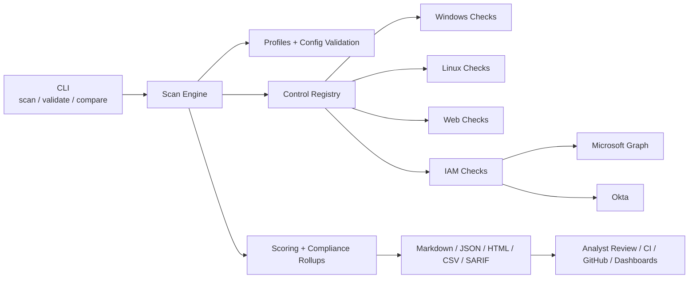
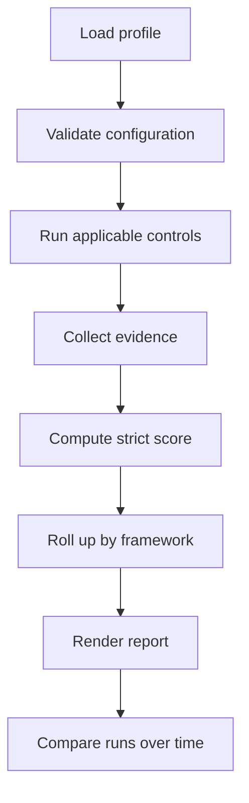

# controlguard

Automated security control validation lab for Windows, Linux, web, Microsoft Entra, and Okta.

`controlguard` est un outil Python qui verifie automatiquement des controles de securite sur une machine, une cible web ou une plateforme IAM, puis produit un rapport exploitable par un analyste, une pipeline CI/CD, ou un exercice de hardening.

## Architecture visuelle



## Workflow visuel



## Pourquoi ce projet

Le projet adresse quatre usages clairs :

- audit : chaque controle produit un statut, une preuve, une source de preuve et une remediaton
- compliance : les controles peuvent etre relies a des frameworks comme `CIS`, `NIST CSF`, `ISO 27001`, `OWASP`
- hardening : les ecarts de configuration sont identifies de maniere actionnable
- automation : les scans retournent des codes de sortie stables et des formats de sortie machine-friendly

## Ce que le moteur sait faire

- scoring strict : `evidence_missing` ne donne aucun point
- separation nette entre `fail`, `error`, `not_applicable` et `evidence_missing`
- controles obligatoires bloquants dans le resume final
- synthese par framework
- validation forte des profils avant execution
- formats de sortie `markdown`, `json`, `html`, `csv`, `sarif`
- comparaison entre deux scans JSON avec delta de score, blockers resolus et regressions

## Controles deja couverts

- pare-feu Windows actif
- Windows Event Log actif
- Microsoft Defender actif
- UAC active
- PowerShell Script Block Logging actif
- RDP desactive
- SMBv1 desactive
- Secure Boot actif
- ports sensibles exposes
- chiffrement BitLocker du disque systeme
- headers de securite HTTP presents et conformes
- permissions trop larges sur un chemin cible
- MFA admin verifiee automatiquement via Microsoft Graph
- MFA admin verifiee automatiquement via Okta
- pare-feu Linux
- auditd
- SSH password authentication

## Installation

```bash
python -m venv .venv
.venv\Scripts\activate
pip install -e .
```

## Profils integres

- `lab` : profil de demonstration complet
- `windows-workstation` : hardening poste Windows
- `linux-server` : hardening serveur Linux
- `web-application` : controles web et security headers
- `entra-admin-mfa` : MFA admin via Microsoft Graph
- `okta-admin-mfa` : MFA admin via Okta

## Commandes utiles

Lancer le profil principal :

```bash
controlguard scan --profile lab
```

Valider seulement un profil :

```bash
controlguard validate --profile windows-workstation
```

Exporter un rapport HTML :

```bash
controlguard scan --profile windows-workstation --format html --output reports/windows.html
```

Exporter uniquement les findings en SARIF :

```bash
controlguard scan --profile lab --only-failed --format sarif --output reports/lab.sarif
```

Comparer deux scans JSON :

```bash
controlguard compare --baseline reports/baseline.json --current reports/current.json --format markdown
```

## Configuration Microsoft Graph

Le controle `microsoft_graph_admin_mfa` utilise `userRegistrationDetails` pour verifier les comptes admin actifs.

Variables d'environnement attendues :

```powershell
$env:CONTROLGUARD_GRAPH_TENANT_ID="your-tenant-id"
$env:CONTROLGUARD_GRAPH_CLIENT_ID="your-app-client-id"
$env:CONTROLGUARD_GRAPH_CLIENT_SECRET="your-app-client-secret"
controlguard scan --profile entra-admin-mfa --format markdown
```

Pre-requis :

- permission Graph `AuditLog.Read.All` en application
- consentement admin
- licence Microsoft Entra ID P1 ou P2 pour les rapports d'authentification

## Configuration Okta

Le controle `okta_admin_mfa` liste les utilisateurs avec role admin puis verifie qu'ils ont au moins un facteur MFA fort actif.

Exemple avec un access token deja acquis :

```powershell
$env:CONTROLGUARD_OKTA_ACCESS_TOKEN="your-okta-access-token"
controlguard scan --profile okta-admin-mfa --format markdown
```

Pre-requis recommandes :

- scopes `okta.roles.read` et `okta.users.read`
- ou API token `SSWS` si tu choisis ce mode
- facteurs forts par defaut : `push`, `signed_nonce`, `webauthn`, `u2f`, `token:software:totp`, `token:hardware`

## Codes de sortie

- `0` : aucun finding bloquant
- `1` : `fail`, `error` ou `evidence_missing`
- `1` aussi avec `--fail-on-warn` si un `warn` existe
- `1` aussi avec `--strict` si n'importe quel finding existe
- `2` : erreur de configuration, de chargement ou de comparaison

## Formats de sortie

- `markdown` : lecture humaine rapide
- `json` : integration pipeline et post-traitement
- `html` : executive summary + technical details
- `csv` : export tabulaire
- `sarif` : integration security tooling / code scanning

## Ce que le rapport HTML montre

- score ring global
- distribution visuelle des statuts
- distribution visuelle des severites
- cartes par framework
- vue des blockers
- table findings + details techniques repliables

## Ce qui rend le projet solide pour un portfolio cyber

- logique d'audit credible
- coverage multi-surface : host, web, IAM
- connecteurs IAM reels
- controle strict de l'applicabilite et de la preuve
- reporting presentable
- CI et tests automatises

## Pistes suivantes

- validation live sur un vrai tenant Microsoft Graph
- validation live sur un vrai tenant Okta
- connecteurs AWS / Azure / GCP posture
- plus de controles Linux et TLS
- dashboard avec historique de scans
