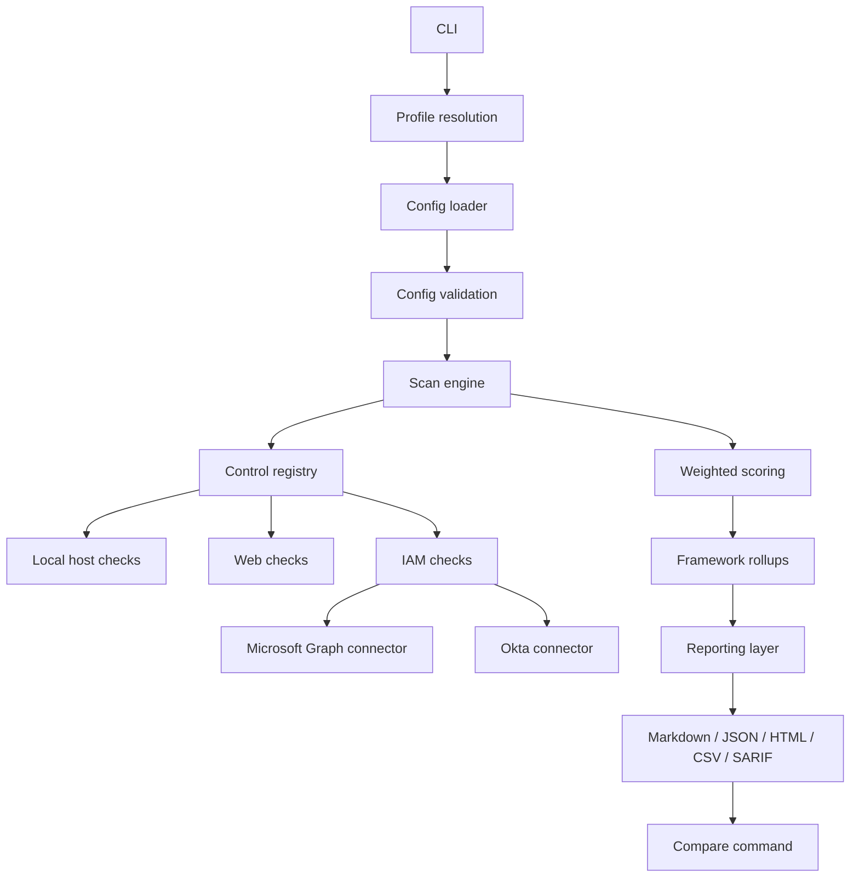

# Architecture

## Purpose

`controlguard` is a security control validation lab that turns configuration checks into structured audit evidence.

The architecture is designed around four priorities:

- strict evidence handling
- deterministic scoring
- pluggable control families
- human + machine readable reporting

## High-level flow

## Main modules

### `controlguard/cli.py`

Entry point for:

- `scan`
- `validate`
- `compare`

Responsibilities:

- argument parsing
- profile selection
- output format routing
- stable exit codes

### `controlguard/loaders.py`

Transforms JSON profiles into typed `ControlDefinition` instances.

Responsibilities:

- file loading
- config parsing
- parameter extraction

### `controlguard/validation.py`

Applies structural validation before execution.

Responsibilities:

- duplicate ID detection
- platform validation
- required parameter checks
- connector-specific guardrails

### `controlguard/engine.py`

Core orchestration layer.

Responsibilities:

- run only applicable controls
- normalize failures into structured results
- compute weighted score
- compute blocking controls
- roll up by framework

### `controlguard/checks/*`

Each file implements one control family:

- `windows.py`
- `linux.py`
- `network.py`
- `web.py`
- `graph.py`
- `okta.py`
- `manual.py`

The registry in `checks/__init__.py` is the control catalog.

### `controlguard/connectors/*`

Thin service clients for external APIs.

- `microsoft_graph.py`
- `okta.py`

These are intentionally dependency-free and built with the Python standard library.

### `controlguard/reporting.py`

Generates presentation outputs.

Responsibilities:

- executive HTML report
- Markdown report
- JSON/CSV exports
- SARIF export

### `controlguard/comparison.py`

Compares two previously generated JSON reports.

Responsibilities:

- score delta
- blocker drift
- control state transitions
- framework delta

## Data model

### `ControlDefinition`

Represents a declared control in a profile.

Important fields:

- `id`
- `type`
- `severity`
- `required`
- `supported_platforms`
- `evidence_source`
- `frameworks`
- `params`

### `ControlResult`

Represents execution output for one control.

Important fields:

- `status`
- `message`
- `evidence`
- `frameworks`
- `remediation`

### `ScanSummary`

Represents global scan outcome.

Important fields:

- weighted score
- counts by status
- blocking controls
- per-framework summaries

## Status model

The tool intentionally distinguishes:

- `pass`
- `warn`
- `fail`
- `error`
- `not_applicable`
- `evidence_missing`

This distinction is central to audit credibility:

- `not_applicable` does not count against the score
- `evidence_missing` gives zero credit
- required controls in blocking states make the scan non-compliant

## Scoring model

Severity is weighted:

- `low = 1`
- `medium = 2`
- `high = 3`
- `critical = 5`

Status contributes a score factor:

- `pass = 1.0`
- `warn = 0.5`
- `fail = 0.0`
- `error = 0.0`
- `evidence_missing = 0.0`
- `not_applicable = excluded`

This is designed so missing evidence never inflates compliance.

## Platform applicability

The engine filters by `supported_platforms` before executing a control.

Current host markers:

- `windows`
- `linux`
- `macos`

Non-OS markers such as `web`, `cloud`, and `network` are descriptive unless combined with an OS marker.

## Connector design principles

External connectors follow these rules:

- credentials come from runtime params or environment variables
- no secrets are committed to the repo
- no third-party SDK is required
- API errors are downgraded into structured evidence states instead of crashing the scan

## Reporting philosophy

Reports are built for two audiences:

- human reviewer: HTML and Markdown
- automation pipeline: JSON, CSV, SARIF

The HTML output emphasizes:

- posture and score
- visual distributions
- blockers
- framework cards
- technical detail expansion

## Known boundaries

The current architecture is strong for a portfolio-grade audit lab, but there are still boundaries:

- live validation on real Microsoft Graph and Okta tenants is environment-dependent
- cloud posture outside IAM is still limited
- no persistent database or historical dashboard is built in yet
- current packaging is repo-centric rather than full SaaS or agent deployment

## Extension points

Best next extension points:

- AWS / Azure / GCP posture connectors
- more Linux controls
- release automation
- historical scan storage
- richer compliance mappings per control
